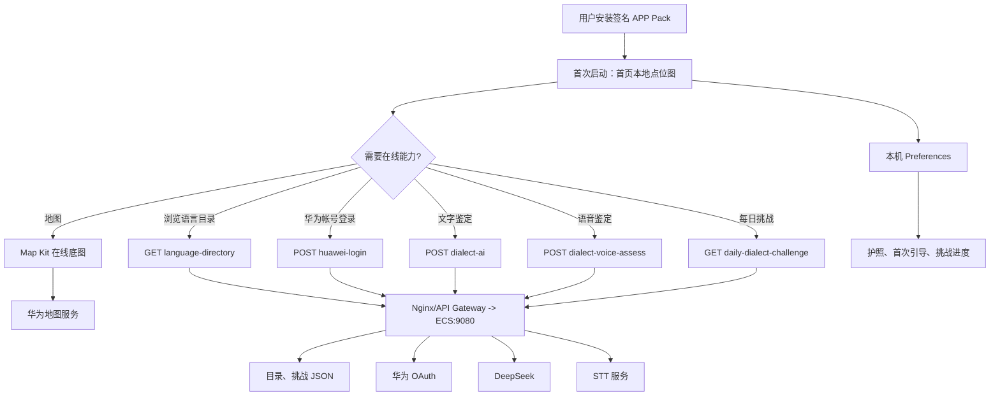

# 乡音地图 1.0.0：前端到后端上架流程

> 本文是发布执行手册，不把“代码已存在”当作“生产能力已就绪”。每一项必须同时满足：部署完成、接口合同验证、真机行为与上架材料一致。

## 1. 发布目标与边界

- 应用：`com.dialectmap.app`，HarmonyOS 手机、平板；当前版本为 `1.0.0 (1000000)`。
- 前端：ArkTS/ArkUI，首页和代表点地图离线优先；Map Kit 仅在在线底图成功时接管。
- 生产 API 域名：`https://hnp666.me`；客户端业务 API 基址为 `https://hnp666.me/functions`。
- 服务端：阿里云 ECS 上的 Python 服务，systemd 单元为 `xiangyin-directory`，仅监听 `127.0.0.1:9080`；Nginx 或 API Gateway 负责 HTTPS 和反向代理。
- 第三方：华为 Map Kit、华为帐号 OAuth、DeepSeek、STT 服务，以及（若启用）已授权的每日挑战音频来源。

发布前必须选定一种实际发行范围：

1. **完整联网版**：启用目录、华为帐号、文字鉴定、语音鉴定、每日挑战，并完成本手册全部后端、隐私和真机验收。
2. **离线体验版**：在代码和商店文案中明确关闭未部署的联网入口；不得仅依赖接口失败后的报错作为“关闭”。

当前客户端已经配置了完整联网版的调用地址，因此默认按完整联网版验收。

## 2. 用户链路与数据流



本地优先数据不会因为服务端不可用而丢失：地图代表点、护照状态、首次引导和挑战进度保留在设备本地。需要特别注意，语音鉴定会把 2–15 秒、16 kHz 单声道 PCM 以 Base64 发送到 ECS；这与“音频永不上传”的离线表述不兼容，必须按最终发行范围更新隐私政策和数据安全声明。

## 3. 客户端与接口合同

| 前端能力 | 当前请求 | ECS 路由 | 依赖/生产条件 | 上架验收 |
| --- | --- | --- | --- | --- |
| 语言目录 | `GET /functions/v1/language-directory` | `GET /functions/v1/language-directory` | `directory-data.json`、HTTPS | 返回 `schemaVersion`、`counts`、目录数组；目录页真机可加载 |
| 华为帐号 | `POST /functions/v1/huawei-login` | 同路径 | OAuth Client ID/Secret、回调地址、会话签名密钥 | 可获得 7 天会话；失败不把本地 OpenID 当登录态 |
| 文字方言体验 | `POST /functions/v1/dialect-ai`，`{text}` | 同路径 | `DEEPSEEK_API_KEY` | 1–2000 字、结果含证据与“体验参考”提示 |
| 语音方言体验 | `POST /functions/v1/dialect-voice-assess` | 同路径 | STT 配置 + DeepSeek | 仅接受 16 kHz/单声道/PCM S16LE、2–15 秒；真机确认上传提示与错误回退 |
| 每日乡音挑战 | `GET /functions/v1/daily-dialect-challenge` | 同路径 | 已审核、明确许可、未过期的音频 URL | 无合规语料时返回 404，客户端显示不可用，不回退演示音频 |
| 在线地图 | Map Kit SDK | 华为服务 | AppGallery Connect Map Kit capability | 在线失败时本地点位图仍可用；定位仅在用户点击后申请 |

服务端源码同时兼容 `/v1/...` 和 `/functions/v1/...`，但客户端正式调用后者；反向代理必须完整保留 `/functions` 前缀。根路径 `/` 不是网页入口，不能用根路径 404 判定 API 故障。

## 4. 后端上线顺序

### 4.1 准备 ECS 与域名

1. 将 `deploy/ecs-directory-service/` 的发布内容复制到 ECS 的 `/opt/xiangyin-directory`；不要把本机 `HarmonySign/`、HAP、APP、证书私钥或 `.env` 打包上传。
2. 以 `www-data` 运行 `xiangyin-directory.service`，服务保持监听 `127.0.0.1:9080`。
3. 在 Nginx 或 API Gateway 配置 `https://hnp666.me`，将 `/healthz`、`/v1/` 与 `/functions/v1/` 反向代理到 `127.0.0.1:9080`；启用有效 TLS 证书和续期监控。
4. 打开最小必要的网络策略：公网仅暴露 HTTPS；ECS 出站仅允许华为 OAuth、DeepSeek、STT 和必要的音频来源。

### 4.2 在 ECS 单独保存密钥

创建权限为 `600`、归属服务账号的 `/etc/xiangyin-directory.env`。以下值绝不进入 HAP、Git、日志或部署压缩包：

```ini
# 文字与语音鉴定
DEEPSEEK_API_KEY=
STT_ENDPOINT=
STT_API_KEY=
STT_MODEL=

# 华为帐号登录
HUAWEI_OAUTH_CLIENT_ID=
HUAWEI_OAUTH_CLIENT_SECRET=
HUAWEI_OAUTH_REDIRECT_URI=
XIANGYIN_SESSION_SIGNING_KEY=
```

`XIANGYIN_SESSION_SIGNING_KEY` 至少 32 个随机字符；密钥出现疑似泄露时先轮换，再重新部署和验收。服务启动后检查 `systemctl status xiangyin-directory` 与日志，确认没有打印密钥、授权码、Access Token、PCM 或完整请求体。

### 4.3 分接口验证，不做“整域名”假设

在部署机或受控运维网络执行：

```bash
curl -i https://hnp666.me/healthz
curl -fsS https://hnp666.me/functions/v1/language-directory -o /tmp/language-directory.json
```

预期 `/healthz` 为 HTTP 200 且包含 `{"status":"ok"}`；目录接口为 HTTP 200 且可被客户端解析。随后用非生产用户的授权码、测试文本、合成的最小合法 PCM 和一条已批准的挑战数据，分别验证其余四个接口的成功、400、401/403（如网关设置）、429、502/503 与超时路径。不得为通过验收而把真实用户音频、生产密钥或华为授权码写入测试记录。

## 5. 前端构建、签名与真机放行

### 5.1 提交前静态检查

- 检查客户端 API 基址与生产域名一致，且没有账号密钥、STT/AI 密钥、`.p12`、Profile 或口令进入版本控制。
- 检查应用信息：包名 `com.dialectmap.app`、`debug=false`、版本号递增、手机/平板目标、权限说明与实际行为一致。
- 在 AppGallery Connect 核对同一包名的 Map Kit capability、华为帐号配置、release 证书与 release Profile。
- 审核目录地点、每日音频、人物/话题文案的来源、许可证、署名和体验边界。

### 5.2 生成候选包

```bash
DEVECO_SDK_HOME=/Applications/DevEco-Studio.app/Contents/sdk \
JAVA_HOME=/Applications/DevEco-Studio.app/Contents/jbr/Contents/Home \
/Applications/DevEco-Studio.app/Contents/tools/node/bin/node \
/Applications/DevEco-Studio.app/Contents/tools/hvigor/bin/hvigorw.js \
clean assembleApp -p buildMode=release --no-daemon --stacktrace
```

构建成功只证明生成了 unsigned APP Pack。由账号持有人在 DevEco Studio 关联 **正式 release** 证书和 Profile，重新构建并校验签名；不要使用 debug 证书上架，也不要提交签名配置与私钥。上传的应是签名后的 `.app`，不是单独 unsigned HAP。

### 5.3 手机与平板验收（必须留当前候选版本证据）

1. 安装签名候选包，验证启动、离线地图、在线地图接管和网络断开回退。
2. 分别拒绝并重新授权定位、麦克风；确认非授权场景不弹权限，拒绝后核心浏览仍可用。
3. 验证目录加载、华为登录、文字鉴定、语音鉴定、每日挑战的正常与服务端不可用提示；检查语音上传前的用户说明和隐私文案。
4. 验证护照创建/清除、分享、系统返回、Light/Dark、大字体、读屏、平板横屏与窗口切换。
5. 检查小艺入口仅在 `isAgentSupport`、账号、协议和网络都满足时显示可用；不以编译通过替代真机可用。

## 6. AppGallery Connect 提交与审核材料

提交前将 [appgallery-listing.md](appgallery-listing.md) 中的待填写项补全，并以当前签名候选包采集截图。最少核对：

- 运营主体、客服联系邮箱、隐私政策公网 URL、数据安全声明、内容分级与版权/许可材料；
- 商店介绍、应用内权限说明、隐私政策与实际联网链路完全一致；
- 手机截图：地图、目录/文字鉴定结果、录音/语音体验、乡音护照；平板截图：横屏分栏或护照页；
- 截图和文案不夸大为真实社交、身份认证、精准方言边界或未经验证的 AI 能力；
- 上传签名 APP Pack 后处理自动检查和人工反馈，审核通过后先小范围测试，再逐步放量。

## 7. 当前发布阻断与放行标准

| 项目 | 当前判断 | 放行条件 |
| --- | --- | --- |
| 正式签名 | 未由源码证明已完成 | AppGallery Connect release 证书/Profile 一致，生成并验证签名 `.app` |
| 真机证据 | 现有记录不足以覆盖当前候选包 | 手机 + 平板完成第 5.3 节全量留证 |
| 联网接口 | 目录已具备明确生产路由；其余接口需逐个验证部署和合同 | 5 条业务路由逐条通过真实环境的成功与失败验收 |
| 隐私与数据安全 | 现有隐私草案仍描述为无账号、无自建业务后台、音频不上传，和完整联网客户端不一致 | 按最终发行范围重写并经主体/法务确认后公网发布 |
| 内容与版权 | 地点、音频和来源仍有待复核项 | 第二人复核、页码/许可证/署名与商店材料一致 |
| 上架材料 | 主体、邮箱、隐私 URL 等仍待填 | 在 AppGallery Connect 提交前全部补齐 |

只有所有阻断项关闭，并完成“接口 HTTP 合同 + 签名构建 + 当前候选真机验收 + 商店材料一致性”四层验证，版本才可以从候选状态进入提交审核。

## 8. 发布后监控与回滚

- 监控启动失败、崩溃、TLS 续期、ECS 存活、`/healthz`、各接口的错误率/延迟，以及 DeepSeek、STT、华为 OAuth 的上游失败。
- 任何权限/隐私不一致、关键链路崩溃、签名或 capability 错配、无授权内容上线，立即停止放量或撤回待审版本。
- 首发没有可回退的公开旧包；修复版本必须递增 `versionCode`，保留 Preferences 键兼容性，并重新完成完整验收。具体动作见 [rollback-plan.md](rollback-plan.md)。
